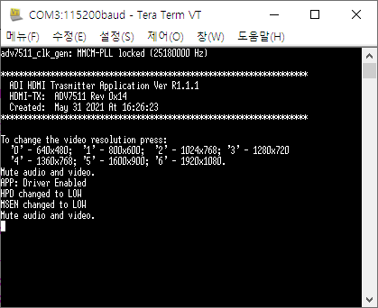

# ADV7511 Zedboard Boards Reference Design Tutorial

하단에 한국어 버전이 있습니다.

## Getting started
This document is based on the requirements below.

- Ubuntu 20.04
- Vivado Design Suite 2019.1
- Xilinx Zedboard

To prevent permission problem, installing everything under home directory is recommended.

## 0. Prerequisites

### 0-1. git
```bash
sudo apt-get install git
```

### 0-2. wine
```bash
sudo apt-get install wine
```

### 0-3. gcc-arm-none-eabi v5.3
The latest version of gcc-arm-none-eabi has some problems with 'Build the HDL Project'. You should remove it with
```bash
sudo apt autoremove gcc-arm-none-eabi
```
You should download compressed file from [here](https://armkeil.blob.core.windows.net/developer/Files/downloads/gnu-rm/gccarmnoneeabi532016q120160330linuxtar.bz2). Download and extract it. After that, add it to the path by
```bash
export PATH=<path_to_extracted_file>/gcc-arm-none-eabi-5_3-2016q1/bin:$PATH
```

### 0-4 setting PATH
You must add Vivado and SDK to the path. Also, you must source the SDK setting.
```bash
export PATH=<path_to_xilinx>/Vivado/bin$PATH
export PATH=<path_to_xilinx>/SDK/bin:$PATH
```

### 0-5 sourcing SDK
You must source SDK's setting64.sh
```bash
source <path_to_xilinx>/SDK/setting64.sh
```

### 1. Download the ADV7511 HDML Transmitter Library
Download the ADV7511 HDML Transmitter Library Installation file from [here](https://www.analog.com/media/en/dsp-hardware-software/software-modules/ADV7511_API_Library.exe). Use the wine to open it in Ubuntu environment.
```bash
cd ~/Downloads
wine ADV7511_API_Library.exe
```
If you didn't change any option during installation, default directory is 
\~/.wine/drive_c/Analog\ Devices/ADV7511_API_Library*

## 2. Build the HDL

### 2-1. Clone the HDL repository
Go to your base workspace directory and clone the HDL repository from [github repository](https://github.com/analogdevicesinc/hdl).
```bash
git clone https://github.com/analogdevicesinc/hdl.git
cd hdl
```

### 2-2. Select your desired branch
The above command clones the 'default' branch, which is the 'master' for HDL. If you want to switch to any other branch you need to checkout that branch.
If you other version of Vivado design suite, you should check [releases](https://github.com/analogdevicesinc/hdl/releases) to find which version of HDI branch to use.
```bash
git status
git checkout hdl_2019_r2
```

### 2-3. Make sure everything is up to date
If this is your first time cloning, you have all the latest source files. If it has been a while, you can simply pull the latest sources using git pull or git rebase if you have local changes.
```bash
git fetch
git rebase origin/hdl_2019_r2
```

### 2-4. Build your desired project
```bash
cd project/adv7511/zed
make
```
After this, you can find system_top.hdf or system_top.xsa file in hdl/project/adv7511/zed/adv7511_zed.sdk

## 3. Build the software
Before build the software, make sure that
- Zedboard is turned on
- Zedboard booting setting is JTAG
- Zedboard and Linux PC are connected with JTAG
- Zedboard and PC are connected with UART
- Baud rate of UART is 115200
- Zedboard and monitor are connected with HDMI
- Monitor is powered on

### 3-1. Clone the building repository
Now, go to your base workspace directory and clone the building repository. After that, go into the project/adv7511 folder
```bash
git clone --recursive https://github.com/analogdevicesinc/no-OS.git
cd no-OS/project/adv7511
```
### 3-2. Select platform
Before build a project, you must set the device to use. Open the app_config.h file in src folder.
```bash
gedit src/app_config.h
```
You can see the c code. Erase the remark icon before the PLATFORM_ZED.
```c
//#define PLATFORM_AC701
//#define PLATFORM_KC705
//#define PLATFORM_VC707
//#define PLATFORM_ZC702
//#define PLATFORM_ZC706
#define PLATFORM_ZED
```
### 3-3 Copy the former files
Copy the hardware design from HDL directory and hdmi transmitter from ADV7511 API library. If you install adv7511 hdmi transmitter library somewhere else, you can use
```bash
cp <path_to_hdl>/hdl/project/adv7511/zed/adv7511_zed.sdk/system_top* .
cp --recursive /<path_to_adv7511_hdmi_transmitter_library>/Src/TX .
```

If you install ADV7511_API_Library without changing installation directory, you can use below code alternatively.
```bash
cp --recursive ~/.wine/drive_c/Analog\ Devices/ADV7511_API_Library*/Src/TX .
```

### 3-4 Build and run
```bash
make run
```
After this, you can see the manual is coming out on uart. You can follow that manual to controll the hdmi interface.



For example, if you type in 6, monitor resolution is changed to 1920 x 1080 and you can see default picture appears on monitor. After that, you can see example picture is on your monitor. The below example picture is with monitor resolution 1920 x 1080


## 4. References
If you have any problems above, please visit the reference sites below.

- [ADV7511 Xilinx Evaluation Boards Reference Design](https://wiki.analog.com/resources/fpga/xilinx/kc705/adv7511)
- [Building HDL wiki](https://wiki.analog.com/resources/fpga/docs/build)
- [No-OS github wiki](https://github.com/analogdevicesinc/no-OS/wiki)


# ADV7511 Zedboard Boards Reference Design 튜토리얼


## 시작하기
이 문서는 아래의 환경에 기반해서 작성되었습니다.

- Ubuntu 20.04
- Vivado Design Suite 2019.1
- Xilinx Zedboard

Permission 관련 문제를 피하기 위해, 설치 파일은 home 디렉토리 하에 설치할 것을 추천합니다.

## 0. 전제조건

### 0-1. git
```bash
sudo apt-get install git
```

### 0-2. wine
```bash
sudo apt-get install wine
```

### 0-3. gcc-arm-none-eabi v5.3
gcc-arm-none-eabi의 최신 버전은 'HDL 빌드 프로젝트' 수행 시 문제가 발생합니다. 따라서 사전에 아래의 명령어로 삭제해야 합니다.
```bash
sudo apt autoremove gcc-arm-none-eabi
```
대신, [여기](https://armkeil.blob.core.windows.net/developer/Files/downloads/gnu-rm/gccarmnoneeabi532016q120160330linuxtar.bz2)에서 압축파일을 다운로드 할 수 있습니다. 다운로드 후에 압축을 풀고, 아래의 명령어를 실행하여 PATH에 추가해주십시오.
```bash
export PATH=<path_to_extracted_file>/gcc-arm-none-eabi-5_3-2016q1/bin:$PATH
```

### 0-4 setting PATH
Vivado와 Xilinx SDK는 PATH에 추가되어 있어야 합니다.
```bash
export PATH=<path_to_xilinx>/Vivado/bin$PATH
export PATH=<path_to_xilinx>/SDK/bin:$PATH
```

### 0-5 sourcing SDK
Xilinx SDK의 setting64.sh를 source 해주어야 합니다.
```bash
source <path_to_xilinx>/SDK/setting64.sh
```

### 1. Download the ADV7511 HDML Transmitter Library
[여기](https://www.analog.com/media/en/dsp-hardware-software/software-modules/ADV7511_API_Library.exe)에서 ADV7511 HDML Transmitter Library 설치 파일을 다운로드 할 수 있습니다. Ubuntu 환경에서는 wine 명령어를 사용하여 실행해 주십시오.
```bash
cd ~/Downloads
wine ADV7511_API_Library.exe
```
설치 중에 옵션을 변경하지 않았다면, 기본 디렉토리는 
\~/.wine/drive_c/Analog\ Devices/ADV7511_API_Library*
으로 설정됩니다.

## 2. HDL 빌드하기

### 2-1. HDL repository 복사해오기
기본 작업공간으로 이동해서 [깃허브 사이트에서](https://github.com/analogdevicesinc/hdl) HDL repository 복사해오십시오.
```bash
git clone https://github.com/analogdevicesinc/hdl.git
cd hdl
```

### 2-2. 사용할 branch 설정하기
위의 명령어는 디폴트 branch(HDL에서는 master branch)를 복사해 올 것입니다. 만약 다른 branch를 사용하고 싶다면 먼저 확인을 해주어야 합니다.
만약 Vivado design suite 2019.1이 아닌 다른 버전을 사용하고 있다면, [releases](https://github.com/analogdevicesinc/hdl/releases)에서 어떤 버전의 HDI branch를 사용할 수 있는지 확인해보세요!
```bash
git status
git checkout hdl_2019_r2
```

### 2-3. 문제가 없는지 확인하기
만약 막 HDL 파일을 새로 다운로드 받았다면 문제가 없겠지만, 다운로드한 지 오래되었거나 파일의 일부를 수정하였다면 아래의 명령어를 통해 해당 버전의 최신 소스로 업데이트 할 수 있습니다.
```bash
git fetch
git rebase origin/hdl_2019_r2
```

### 2-4. 빌드하기
```bash
cd project/adv7511/zed
make
```
위의 명령어가 제대로 동작했다면, hdl/project/adv7511/zed/adv7511_zed.sdk 폴더에서 system_top.hdf 또는 system_top.xsa 파일을 찾을 수 있을 것입니다.

## 3. 소프트웨어 빌드하기
소프트웨어를 빌드하기에 앞서, 아래의 항목을 확인하십시오.
- Zedboard의 전원은 켜져 있습니까?
- Zedboard의 부트 설정이 JTAG이 맞습니까?
- Zedboard와 리눅스 PC가 JTAG으로 연결되어 있습니까?
- Zedboard와 PC가 UART로 연결되어 있습니까?
- UART의 Baud rate는 115200으로 설정되어 있습니까?
- Zedboard와 모니터가 HDMI 선으로 연결되어 있습니까?
- 모니터 전원은 켜져 있습니까?

### 3-1. 빌드할 깃허브 repository 복사해오기
이제 기본 작업공간으로 이동하여 빌드할 깃허브 repository를 복사해오십시오. 그 후에 project/adv7511 폴더로 들어가주십시오.
```bash
git clone --recursive https://github.com/analogdevicesinc/no-OS.git
cd no-OS/project/adv7511
```
### 3-2. 플랫폼 선택하기
프로젝트를 빌드하기 전에, 사용할 기기를 설정해주어야 합니다. src/app_config.h 파일을 열어주십시오.
```bash
gedit src/app_config.h
```
c 코드를 확인할 수 있을 것입니다. #define PLATFORM_ZED 앞의 주석 처리를 지워주십시오.
```c
//#define PLATFORM_AC701
//#define PLATFORM_KC705
//#define PLATFORM_VC707
//#define PLATFORM_ZC702
//#define PLATFORM_ZC706
#define PLATFORM_ZED
```
### 3-3 이전에 만든 파일 복사해오기
HDL 디렉토리에서 하드웨어 디자인과 ADV7511 APV library에서 hdmi transmitter를 복사해오십시오. 만약 1번에서 adv7511 hdmi transmitter library를 다른 폴더에 설치하였다면 아래의 코드를 사용하시면 됩니다.
```bash
cp <path_to_hdl>/hdl/project/adv7511/zed/adv7511_zed.sdk/system_top* .
cp --recursive /<path_to_adv7511_hdmi_transmitter_library>/Src/TX .
```

만약 2번에서 adv7511 hdmi transmitter library를 설치할 때, 설치 디렉토리를 변경하지 않았다면, 아래의 코드로 hdmi transmitter를 복사해 올 수 있을 것입니다.
```bash
cp --recursive ~/.wine/drive_c/Analog\ Devices/ADV7511_API_Library*/Src/TX .
```

### 3-4 빌드 및 실행
```bash
make run
```
위의 코드를 실행하면, UART 화면에 설명이 나타나는 것을 볼 수 있을 것입니다. 설명을 따라 HDMI 설정을 변경해주세요.


예를 들어서 숫자 6을 치면, 모니터 해상도가 1920 x 1080으로 변경되고, 모니터에 기본 이미지가 나타나는 것을 볼 수 있을 것입니다. 아래의 사진은 해상도 1920 x 1080에서 모니터에 나타나는 화면입니다.


## 4. 참조
위에서 문제가 발생했다면, 아래의 사이트를 방문해보세요!

- [ADV7511 Xilinx Evaluation Boards Reference Design](https://wiki.analog.com/resources/fpga/xilinx/kc705/adv7511)
- [Building HDL wiki](https://wiki.analog.com/resources/fpga/docs/build)
- [No-OS github wiki](https://github.com/analogdevicesinc/no-OS/wiki)
